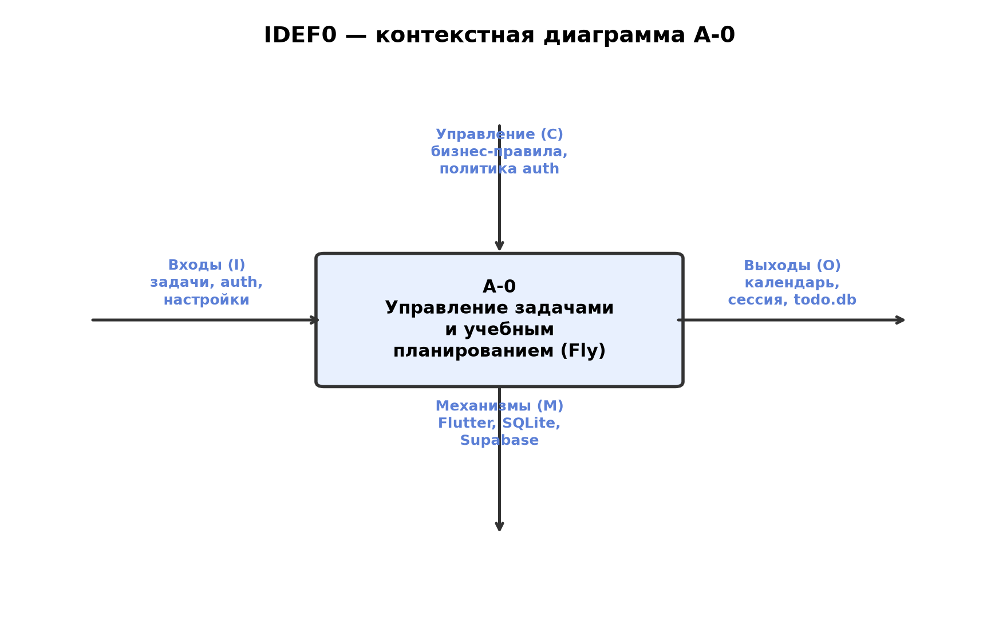
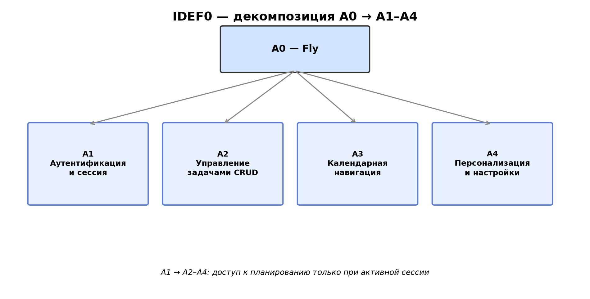
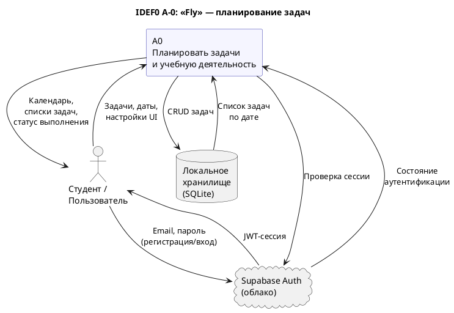

# Диаграмма бизнес-контекста (IDEF0 A-0)

Контекстная диаграмма описывает систему «Fly» как единый процесс верхнего уровня
и её взаимодействие с внешней средой.

PlantUML (исходник A-0)

## Описание входов, выходов, механизмов и управления

| Элемент IDEF0 | Описание |
|---------------|----------|
| **Вход (I)** | Текст задачи, описание, дата, время, команды пользователя (создать, отметить, удалить) |
| **Выход (O)** | Отображение задач по дням, недельный/месячный календарь, персонализированный интерфейс |
| **Управление (C)** | Требования курсового проекта, методические указания, политика Supabase |
| **Механизм (M)** | Flutter-приложение, SQLite, Supabase SDK, устройство пользователя |
