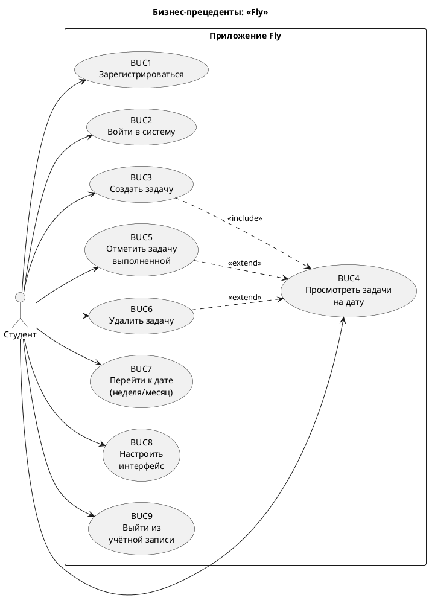

# Диаграмма бизнес-прецедентов (BUC)

Бизнес-прецеденты описывают взаимодействие пользователя с системой на уровне
предметной области (до технической реализации).

## Реестр бизнес-прецедентов

| ID | Прецедент | Актор | Ценность для пользователя |
|----|-----------|-------|---------------------------|
| BUC1 | Регистрация | Студент | Персональный доступ к приложению |
| BUC2 | Вход | Студент | Безопасное начало работы |
| BUC3 | Создание задачи | Студент | Фиксация учебного/личного плана |
| BUC4 | Просмотр задач на дату | Студент | Контроль нагрузки на конкретный день |
| BUC5 | Отметка выполнения | Студент | Отслеживание прогресса |
| BUC6 | Удаление задачи | Студент | Актуализация плана |
| BUC7 | Навигация по календарю | Студент | Обзор недели и месяца |
| BUC8 | Настройка интерфейса | Студент | Комфорт и индивидуальность |
| BUC9 | Выход | Студент | Завершение сессии на устройстве |
