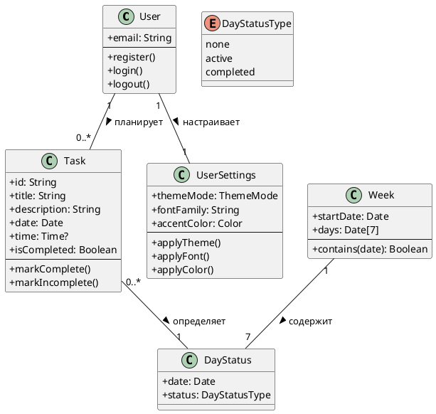

# Модель бизнес-классов

Концептуальная модель предметной области на бизнес-уровне (без технических деталей реализации).

## Описание классов

| Класс | Ответственность |
|-------|-----------------|
| **User** | Учётная запись и аутентификация (облако Supabase) |
| **Task** | Основная сущность планирования |
| **Week** | Представление недельного интервала для навигации |
| **UserSettings** | Персональные настройки интерфейса |
| **DayStatus** | Агрегированный статус дня по задачам |
