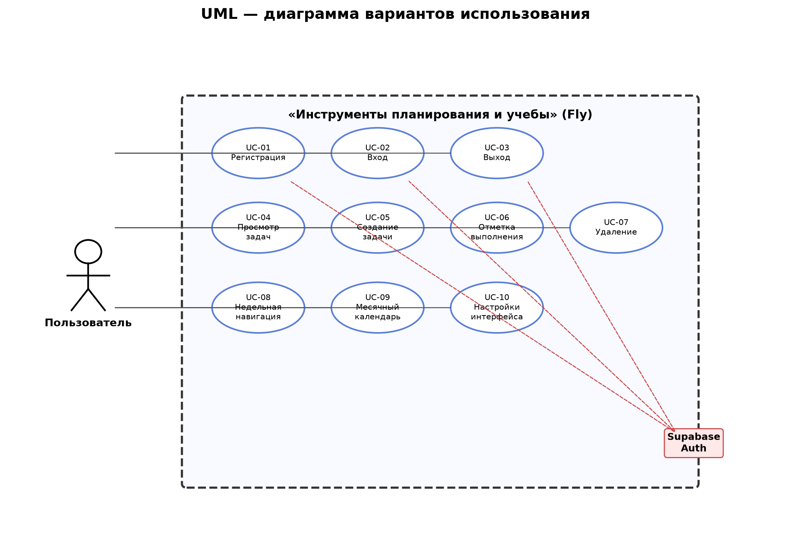
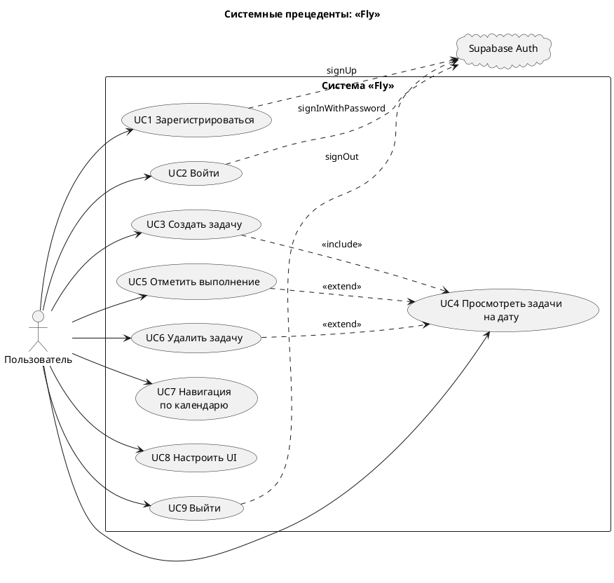

# Диаграмма системных прецедентов (Use Case)

PlantUML (исходник)

## Реестр прецедентов

| ID | Прецедент | Актор | Приоритет | Компонент |
|----|-----------|-------|:---------:|-----------|
| UC1 | Регистрация | Пользователь | High | `AuthScreen`, Supabase |
| UC2 | Вход | Пользователь | High | `AuthScreen`, `AuthGate` |
| UC3 | Создание задачи | Пользователь | High | `AddTaskPage`, `TaskController` |
| UC4 | Просмотр задач на дату | Пользователь | High | `HomePage`, `TaskCard` |
| UC5 | Отметка выполнения | Пользователь | High | `TaskCard`, `TaskController` |
| UC6 | Удаление задачи | Пользователь | Medium | `TaskDetailDialog` |
| UC7 | Навигация по календарю | Пользователь | High | `WeekPageView`, `TaskCalendarDialog` |
| UC8 | Настройка интерфейса | Пользователь | Medium | `SettingsPage`, `SettingsModel` |
| UC9 | Выход | Пользователь | Medium | `SettingsPage`, Supabase |
