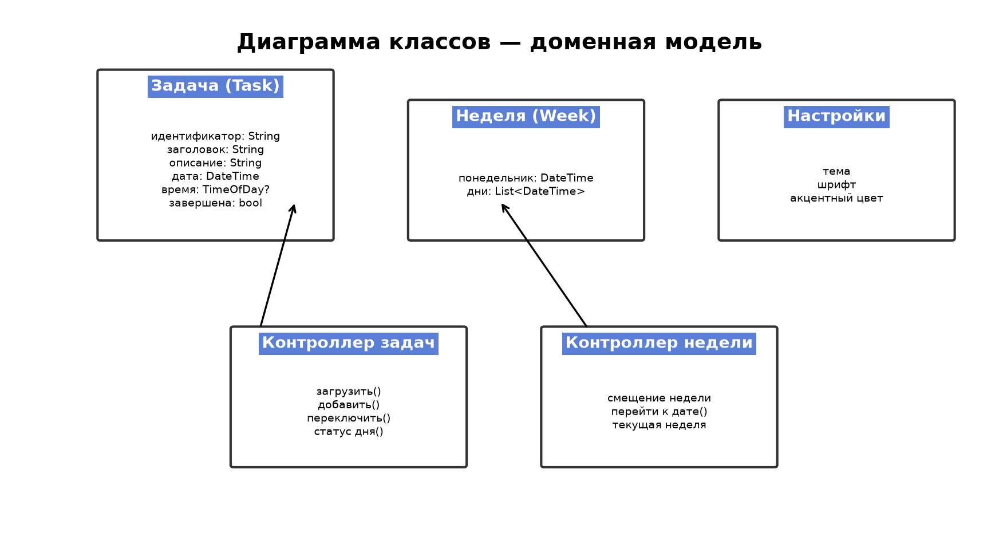
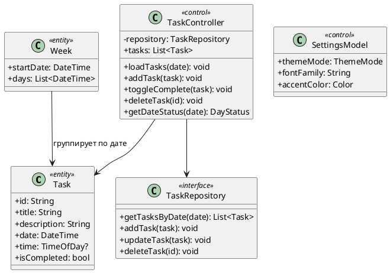

# Доменная модель (концептуальная)

PlantUML (исходник)

## Инварианты домена

1. `Task.title` не может быть пустым при сохранении.
2. `Task.date` хранится без времени суток (только календарная дата).
3. `Task.time` опционально; задачи без времени сортируются после задач с временем.
4. `Task.id` уникален в пределах локальной БД.
