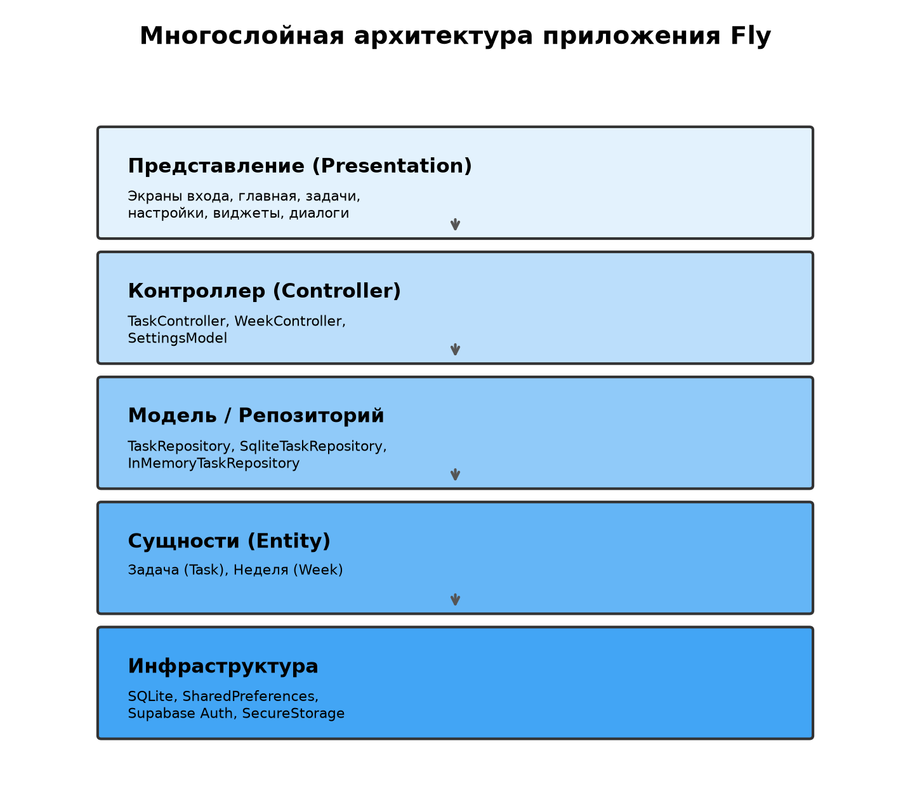
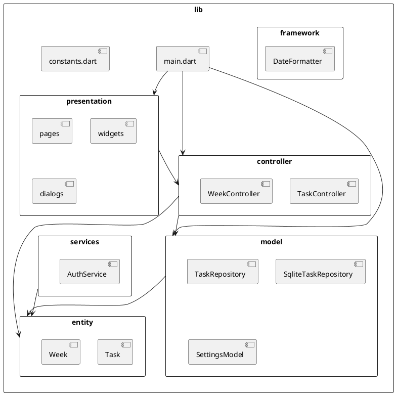

# Диаграмма пакетов



<details>
<summary>PlantUML (исходник)</summary>



</details>

## Структура каталогов

```
lib/
├── main.dart
├── constants.dart
└── src/
    ├── controller/
    ├── entity/
    ├── framework/
    ├── model/
    ├── presentation/
    │   ├── dialogs/
    │   ├── pages/
    │   └── widgets/
    └── services/
```
