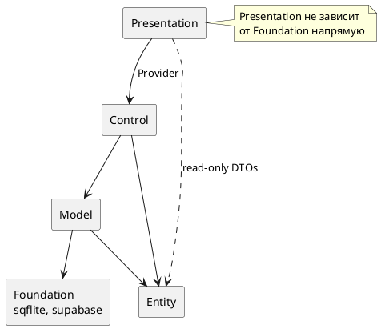

# Диаграмма зависимостей (ацикличность)



## Правила зависимостей

1. Зависимости направлены **строго сверху вниз**.
2. `entity` не импортирует `presentation`, `controller`, `model`.
3. `TaskRepository` (интерфейс) объявлен в `model`; реализация SQLite — там же.
4. `main.dart` — composition root: создаёт БД, репозиторий, контроллеры, Provider.

## Проверка

```bash
flutter analyze
```

Нарушений циклических зависимостей между слоями не выявлено.
