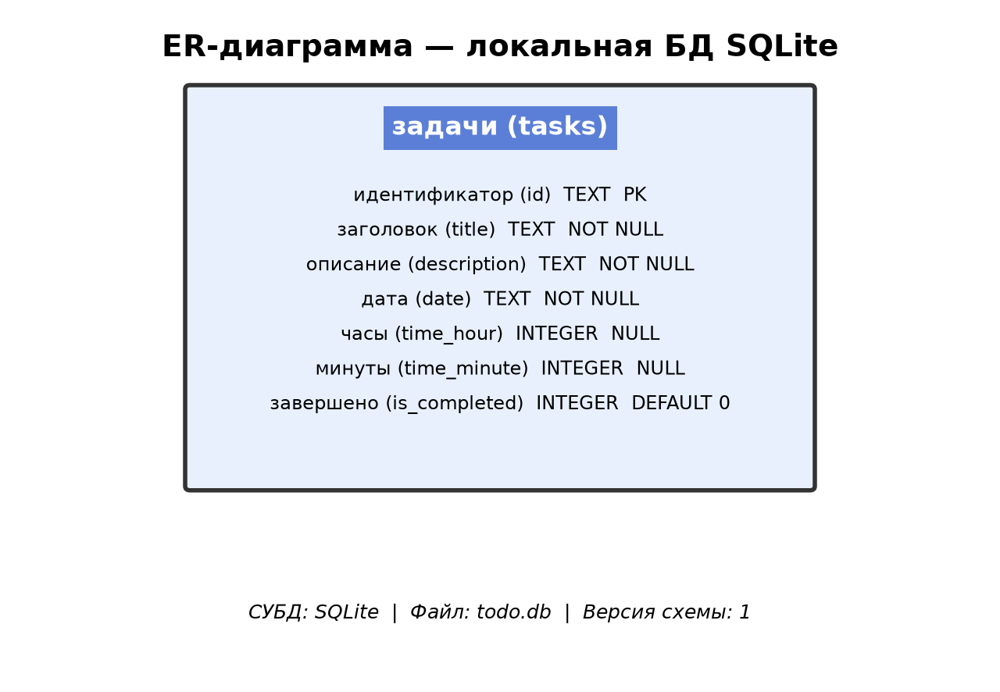
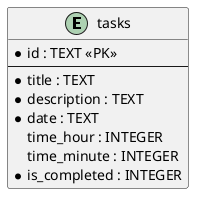

# ER-диаграмма (логическая модель)

PlantUML (исходник)

## Описание сущности

| Сущность | Описание |
|----------|----------|
| **tasks** | Задачи пользователя с привязкой к календарной дате |

## Связи

В текущей версии MVP таблица `tasks` автономна (нет внешних ключей).
Привязка к пользователю Supabase не реализована на уровне БД.

## Настройки (вне ER-модели SQLite)

| Ключ SharedPreferences | Тип | Описание |
|------------------------|-----|----------|
| `theme_mode` | String | `light` / `dark` |
| `font_family` | String | Имя шрифта |
| `accent_color` | int | ARGB значение цвета |
