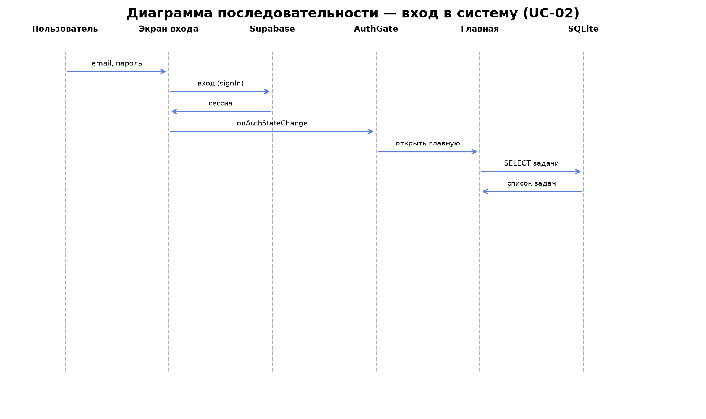
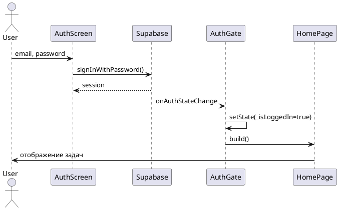
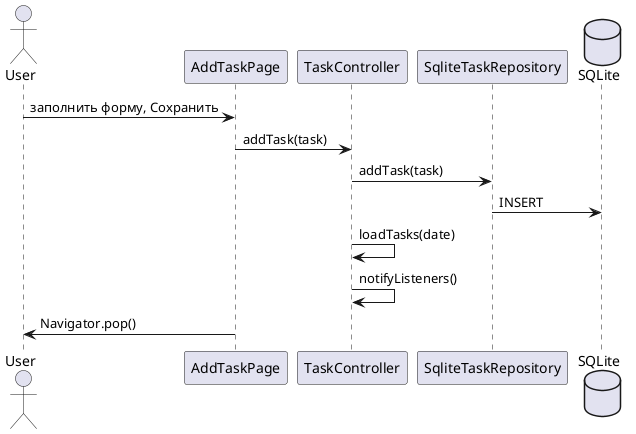
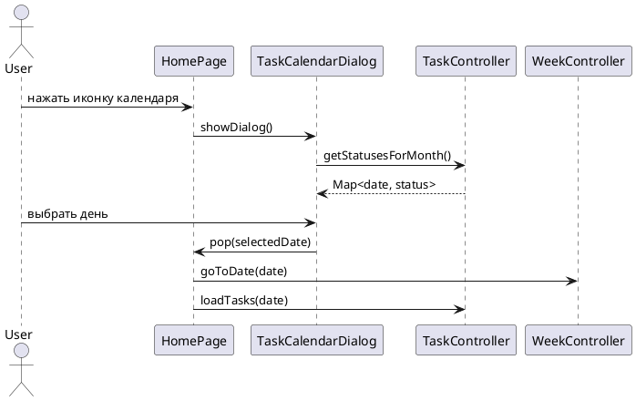

# Диаграммы последовательностей

## 1. Вход пользователя (UC2)

PlantUML (исходник)

```plantuml
@startuml
actor User
participant AuthScreen
participant Supabase
participant AuthGate
participant HomePage

User -> AuthScreen : email, password
AuthScreen -> Supabase : signInWithPassword()
Supabase --> AuthScreen : session
Supabase -> AuthGate : onAuthStateChange
AuthGate -> AuthGate : setState(_isLoggedIn=true)
AuthGate -> HomePage : build()
HomePage -> User : отображение задач
@enduml
```

## 2. Создание задачи (UC3)

```plantuml
@startuml
actor User
participant AddTaskPage
participant TaskController
participant SqliteTaskRepository
database SQLite

User -> AddTaskPage : заполнить форму, Сохранить
AddTaskPage -> TaskController : addTask(task)
TaskController -> SqliteTaskRepository : addTask(task)
SqliteTaskRepository -> SQLite : INSERT
TaskController -> TaskController : loadTasks(date)
TaskController -> TaskController : notifyListeners()
AddTaskPage -> User : Navigator.pop()
@enduml
```

## 3. Навигация по месячному календарю (UC7)

```plantuml
@startuml
actor User
participant HomePage
participant TaskCalendarDialog
participant TaskController
participant WeekController

User -> HomePage : нажать иконку календаря
HomePage -> TaskCalendarDialog : showDialog()
TaskCalendarDialog -> TaskController : getStatusesForMonth()
TaskController --> TaskCalendarDialog : Map<date, status>
User -> TaskCalendarDialog : выбрать день
TaskCalendarDialog -> HomePage : pop(selectedDate)
HomePage -> WeekController : goToDate(date)
HomePage -> TaskController : loadTasks(date)
@enduml
```
