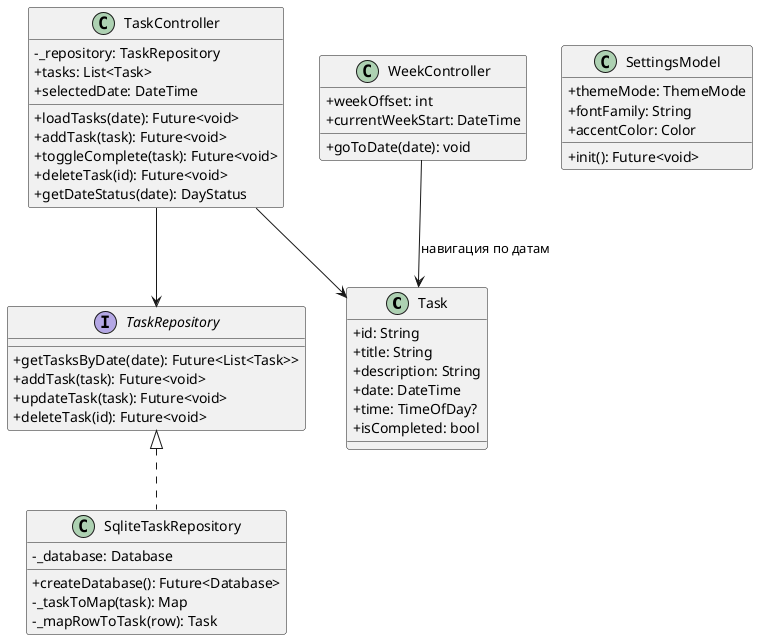

# Диаграмма классов проектирования

## Перечисление DayStatus

Используется в `TaskController.getDateStatus()`:

| Значение | Условие |
|----------|---------|
| `none` | Нет задач на дату |
| `active` | Есть невыполненные задачи |
| `completed` | Все задачи выполнены |
