# Этап 7. Пользовательский интерфейс (Flutter)

Presentation-слой — кроссплатформенное приложение на **Flutter + Material Design 3**.
Код в `lib/src/presentation/`.

## Экраны (4 pages + 2 dialogs, требование методички ≥ 5 — выполнено с учётом диалогов)

| Экран / диалог | Файл | Назначение |
|----------------|------|------------|
| AuthGate | `main.dart` | Маршрутизация по сессии |
| Вход / регистрация | `auth_screen.dart` | Email + password |
| Главная | `home_page.dart` | Задачи, неделя, FAB |
| Добавление задачи | `add_task_page.dart` | Форма создания |
| Настройки | `settings_page.dart` | Тема, шрифт, цвет, выход |
| Детали задачи | `task_detail_dialog.dart` | Просмотр, удаление |
| Месячный календарь | `task_calendar_dialog.dart` | Выбор даты, статусы |

## Виджеты

| Виджет | Файл | Назначение |
|--------|------|------------|
| `DateHeader` | `date_header.dart` | Шапка: настройки, дата, календарь |
| `WeekPageView` | `week_page_view.dart` | Свайп между неделями |
| `WeekLabelsHeader` | `week_labels_header.dart` | Пн–Вс, «Сегодня» |
| `WeekDatesRow` | `week_dates_row.dart` | Кружки дней недели |
| `TaskCard` | `task_card.dart` | Строка задачи + checkbox |
| `DashedCircleBorder` | `dashed_circle_border.dart` | Обводка «сегодня» |

## Архитектура UI

| Аспект | Реализация |
|--------|------------|
| Состояние | Provider + `ChangeNotifier` |
| Навигация | `Navigator.push` / `showDialog` |
| Тема | `MaterialApp.themeMode`, `ColorScheme.fromSeed` |
| Локализация | `Locale('ru')`, `intl` |
| Шрифты | Roboto, Impact, Saxonia Antiqua (`fonts/`) |

## Обработка состояний

- **AuthGate:** logged in / logged out
- **HomePage:** loading tasks, empty list, active + completed sections
- **AuthScreen:** loading indicator при submit, SnackBar при ошибке

## Запуск

```bash
flutter run                  # устройство по умолчанию
flutter run -d chrome        # веб
flutter run -d windows       # Windows
```

## Скриншоты (реальное приложение)

Источник: `C:\Users\Said\KURSACH 3\приложение` → `screenshots/`.

### Аутентификация

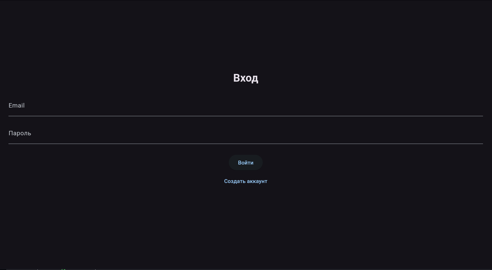
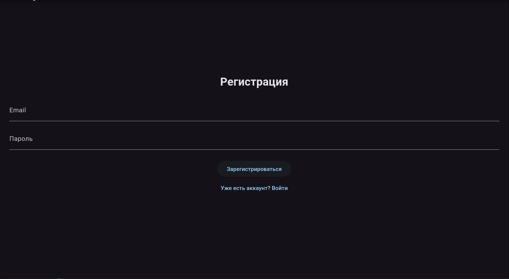

### Главный экран

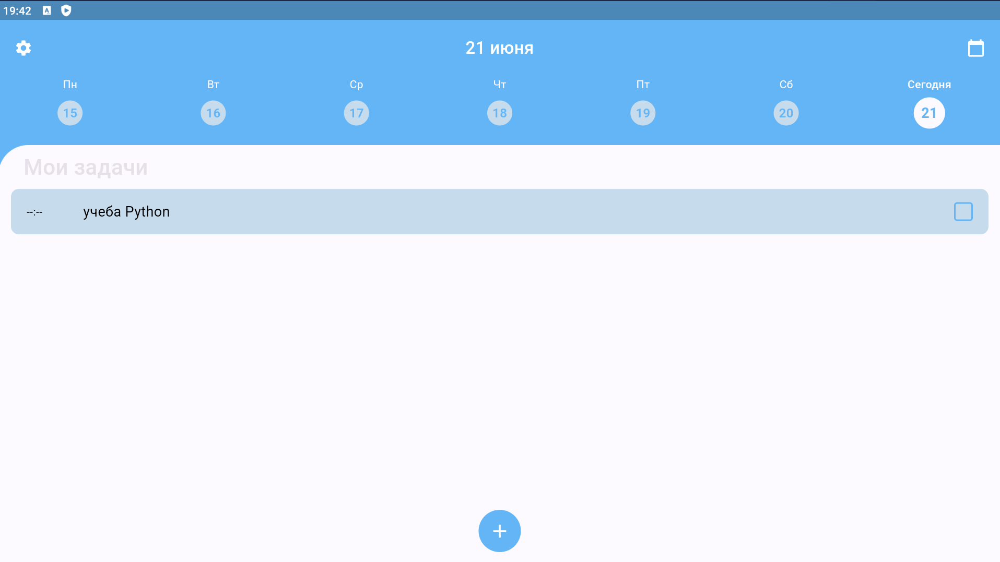
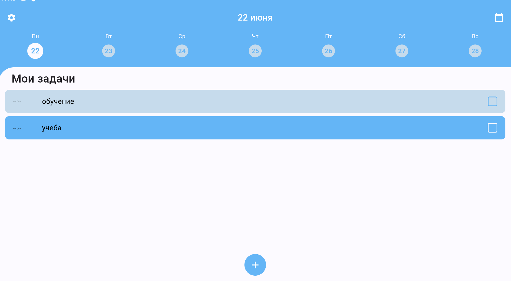
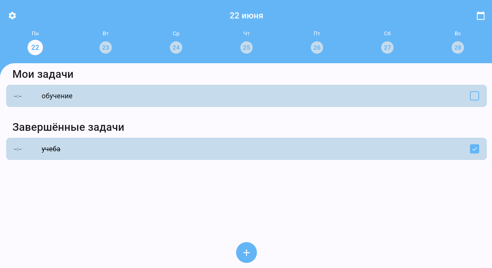

### Календарь

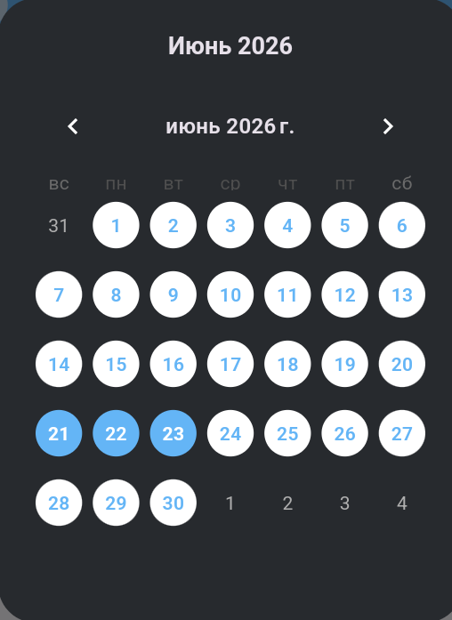

### Создание задачи

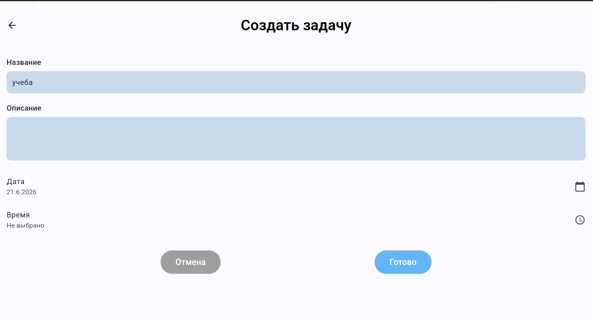
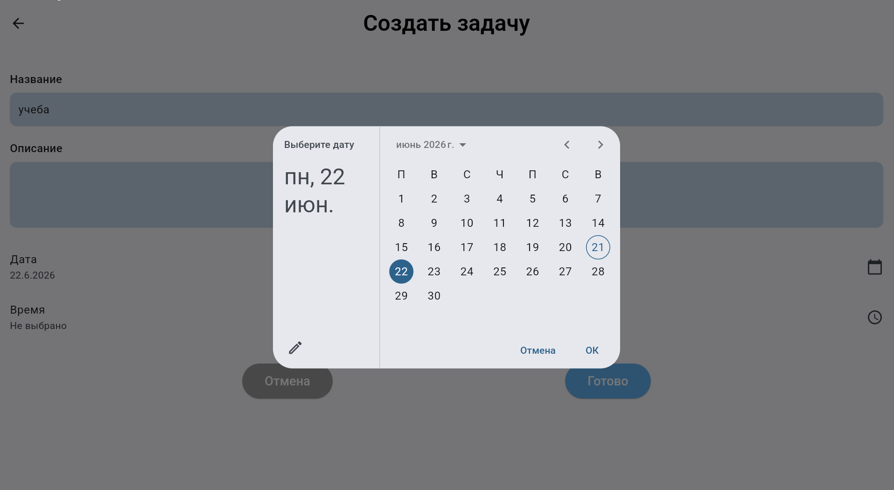
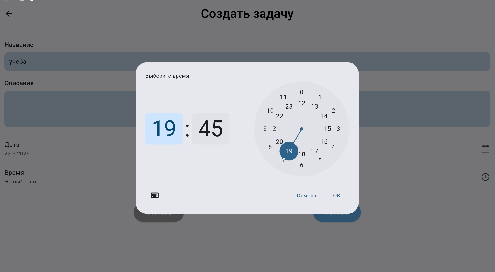

### Настройки

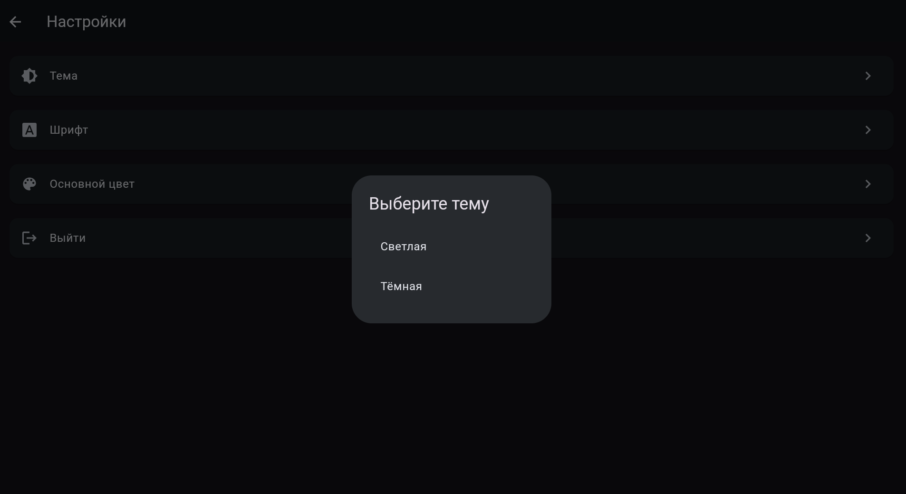
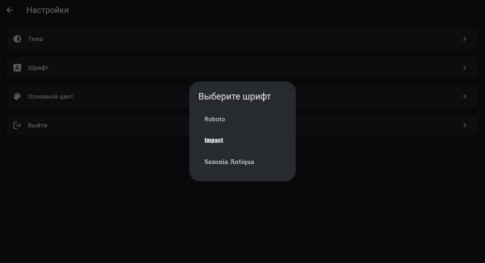
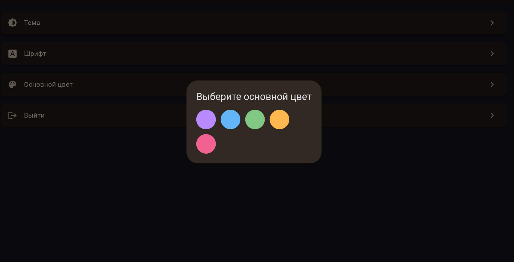
